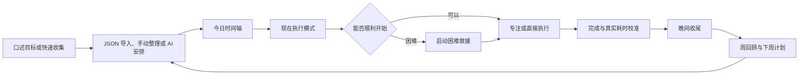
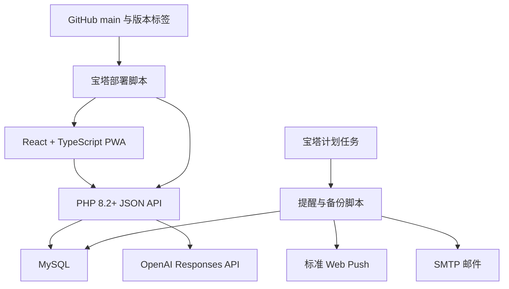
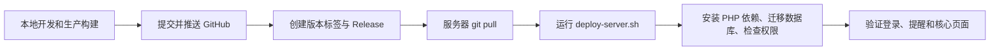

# 人生看板项目全景

## 项目简介

人生看板是一个为单用户设计的个人计划与执行系统。它不要求用户经营复杂的游戏，也不通过惩罚制造压力，而是把学习、健身、生活习惯和娱乐安排整理成当天可以直接执行的下一步。

项目最初尝试使用 2D 庭院成长提供正反馈。实际讨论后发现，手动布置和经营庭院本身也会消耗精力，因此在 2026 年 8 月 4 日整体重构为简洁的人生看板。庭院原型保留在 Git 历史和 `v0.x` 版本中，当前产品从 `v1.0.0` 开始。

当前版本为 **v1.14.0**，线上部署于 `life.snowmoon1824.top`。

## 产品目标

- 降低开始任务前的选择成本。
- 把口头目标转成可以执行和提醒的计划。
- 在精力变化或计划被打断后快速重新安排。
- 用专注、完成和真实耗时形成反馈，而不是制造虚假进度。
- 让提醒在 iPhone 上及时出现，同时避免邮件过度打扰。
- 保证个人数据可导出、可备份、可恢复并由用户自己掌握。

## 设计原则

1. **一次只看下一步**：执行页面优先展示当前最值得做的一项任务。
2. **计划服务于人**：日程需要避开吃饭、休息和固定安排，并允许低能量模式。
3. **启动比完美更重要**：任务难以开始时，可以先做 2、5 或 10 分钟的最小动作。
4. **反馈必须来自真实数据**：完成率、专注时间和项目进度都来自数据库，不使用演示数字填充空状态。
5. **AI 只提供建议**：AI 安排必须先预览，用户确认后才会修改日程。
6. **减少维护负担**：系统自动生成循环任务、发送提醒和执行备份，不把管理软件变成新的任务。

## 使用闭环



## 主要功能

| 模块 | 能力 |
| --- | --- |
| 现在 | 聚焦当前任务，支持开始、暂停、完成、延后、跳过和救援 |
| 今日 | 时间轴、快速收集、任务与习惯概览、动态重排 |
| 收集箱 | 保存尚未安排的想法和任务，并按状态筛选 |
| 日历 | 日、周、月视图，展示普通任务与循环任务 |
| 项目 | 管理项目阶段、下一步行动和真实完成进度 |
| 习惯 | 每周打卡、补签、休息日和连续完成统计 |
| 专注 | 持久化计时，支持暂停、继续、结束和离开自动暂停 |
| 每日节奏 | 晨间启动、今日重点、晚间收尾和未完成任务安置 |
| 回顾 | 周完成率、时间投入、卡点、文字回顾和下周计划 |
| AI 安排 | 根据任务、精力、用餐和时间窗生成可确认的日程建议 |
| 计划导入 | 从 Life Plan JSON 导入项目、习惯和循环任务，并支持整批撤销 |
| 提醒 | iPhone Web Push、邮件提醒、每日摘要和逾期摘要 |
| 数据安全 | JSON 导出、服务器备份、恢复预览、密码确认和恢复前备份 |

## 技术架构



- 前端：React、TypeScript、Vite、Lucide 图标。
- 后端：PHP 8.2+，使用 PDO 访问 MySQL。
- 登录：单用户密码登录、CSRF 防护和安全会话 Cookie。
- AI：OpenAI Responses API，默认使用低成本 mini 模型并限制每日调用次数。
- 通知：标准 Web Push、PWA Service Worker、PHPMailer 和 SMTP。
- 部署：本地构建静态资源，GitHub 保存源码与版本，宝塔服务器执行更新脚本。

## 版本与更新历程

| 版本 | 日期 | 主要进展 |
| --- | --- | --- |
| `v0.1.0` | 2026-07-21 | 建立 Sakura Life 原型，验证打卡与庭院正反馈方向 |
| `v0.2.0` | 2026-07-22 | 完善庭院反馈、下一任务提示和低内存服务器部署 |
| `v1.0.0` | 2026-08-04 | 推倒重构为 React、PHP、MySQL 单用户人生看板 |
| `v1.1.0` | 2026-08-04 | 完成设置路由、站点图标和 SMTP 诊断 |
| `v1.2.0` | 2026-08-04 | 完成任务生命周期并用真实统计替换占位数据 |
| `v1.3.0` | 2026-08-04 | 加入 AI 辅助安排、预览确认和站内通知中心 |
| `v1.4.0` | 2026-08-05 | 加入 JSON 计划导入、循环任务修复和合理生活时段 |
| `v1.5.0` | 2026-08-06 | 加入专注计时、持久化状态和离开自动暂停 |
| `v1.6.0` | 2026-08-09 | 加入计划边界、用餐缓冲和安全备份恢复 |
| `v1.7.0` | 2026-08-11 | 加入只关注下一项任务的“现在”执行模式 |
| `v1.8.0` | 2026-08-11 | 加入晨间启动、晚间收尾和连续完成统计 |
| `v1.9.0` | 2026-08-11 | 加入周回顾、文字反思和下周计划 |
| `v1.10.0` | 2026-08-11 | 加入预估与真实投入的计划校准 |
| `v1.11.0` | 2026-08-11 | 加入根据精力和剩余时间自适应重排日程 |
| `v1.12.0` | 2026-08-11 | 加入启动困难救援和最小动作计时 |
| `v1.13.0` | 2026-08-12 | 加入 iPhone PWA、后台 Web Push 和多设备订阅 |
| `v1.13.1` | 2026-08-12 | 修复 Composer 依赖和线上 `.env` 读取权限 |
| `v1.14.0` | 2026-08-12 | 完成手机通知直达、快速处理和稍后提醒闭环 |

每个版本的详细新增与修复内容见 [CHANGELOG.md](CHANGELOG.md)，对应代码快照和发行说明见 [GitHub Releases](https://github.com/MTL-Sakura/Life/releases)。

## 部署流程



服务器更新命令：

```bash
cd /www/wwwroot/life.snowmoon1824.top
git pull origin main
bash scripts/deploy-server.sh
```

详细环境配置、宝塔计划任务和备份说明见 [README.md](README.md)。新版本的编号、标签和 Release 创建规范见 [docs/RELEASE_PROCESS.md](docs/RELEASE_PROCESS.md)。

## 当前状态

当前版本已经具备从计划输入、日程安排、执行提醒、手机快速处理、专注与救援，到每日收尾和周回顾的完整闭环。下一阶段不急于增加大量模块，而是优先通过真实使用观察提醒频率、任务延后、预估偏差和启动卡点，再完善通知降噪与执行数据反馈。
